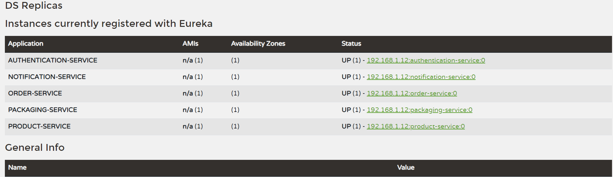

To get started with the project, you should first load the project and start the services. You can then access the discovery service at the following address with following credentials:

http://localhost:8761
```
{ 
  username: 'admin', 
  password: 'pwd'
}
```

clicking os Status pages will redirect to swagger page of each service.(Main swagger is not configured on Discovery service)


The message service for this project uses RabbitMQ. To start the service using Docker, run the following command:
```
docker run -d --hostname my-rabbit --name some-rabbit -p 15672:15672 -p 5672:5672 rabbitmq:3-management
```
Please note that the services will work without RabbitMQ, but some functionality may not be available.

If you need to get an administrator user, you can use the following credentials:
```
{email: string, password: string}
```
This will return a token that can be used for calling methods that require administrator access.


The database for this project is running on AWS DRS. MySQL database credentials:
```
{
    url : database-1.cvqmurxkyavv.us-east-1.rds.amazonaws.com/users,
    username : admin, 
    password : password}
```